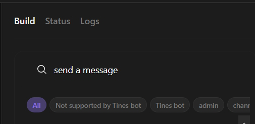
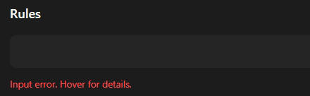
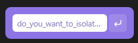
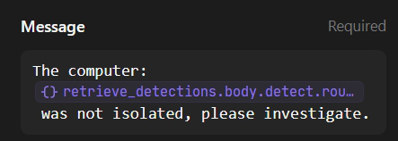
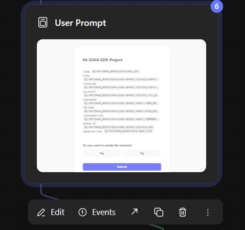
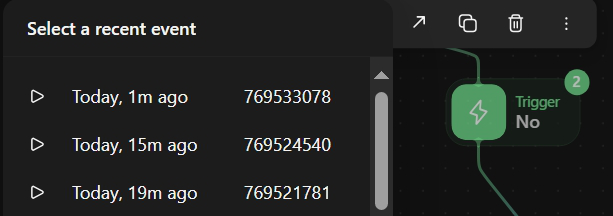

# SOAR-EDR Project Overview

## Table of Contents
1. Introduction and Foundations
   - Presenting EDR
   - Presenting SOAR
   - Project Overview
   - Workflow
   - Environment
2. Preparatory Setup
   - Prerequisites
   - System Verification
3. Threat Simulation Tool
   - LaZagne Password Recovery Tool
4. LimaCharlie Configuration
   - Account Setup
   - Installation Key Creation and Session Download
   - Sensor Installation
   - Creating a New Detection and Response (D&R) Rule
5. Communication Platform Configuration
   - Creating a Slack Account and Setting Up a New Workspace
   - Tines Configuration
     - Connecting to LimaCharlie
     - Connecting to Slack
     - Connecting to Email
   - Incident Message Details Template
6. Incident Response Framework
   - Isolate Computer Prompt
   - Handling User Responses (No)
   - Handling User Responses (Yes)
     - Isolation Status and Messaging


## Introduction

### What is edr?
EDR (Endpoint Detection and Response) is a cybersecurity technology that detects, investigates, and responds to advanced threats on endpoint devices like laptops, desktops, and servers. It provides real-time monitoring, threat detection, and incident response capabilities to help protect against cyber attacks.

### What is SOAR?
SOAR (Security Orchestration, Automation, and Response) is a cybersecurity technology that automates and streamlines security incident response processes. It integrates with various security tools to provide a centralized platform for threat detection, incident response, and remediation, helping to improve efficiency and reduce response times.

### Project Overview
…..
### Workflow

### Project Environment

A hands-on cybersecurity automation project utilizing Kali Linux as the primary operating system, VirtualBox for virtualization, LimaCharlie as the endpoint detection and response (EDR) platform, Tines for security orchestration, Slack for communication, and LaZagne as a simulated password recovery tool to demonstrate and test a comprehensive security detection and response workflow.

**Kali Linux**
   - Primary operating system for the project
   - Renowned cybersecurity and penetration testing distribution
   - Provides robust tools and environment for security research and implementation
   - Used as the main control and development platform

**VirtualBox**
   - Virtualization software enabling multiple operating system instances
   - Allows creation and management of virtual machines
   - Provides isolated and controlled testing environment
   - Enables safe deployment of test systems without affecting primary hardware

**LimaCharlie**
   - Cloud-based endpoint detection and response (EDR) platform
   - Provides real-time monitoring and detection capabilities
   - Enables custom rule creation and automated response mechanisms
   - Serves as the primary threat detection tool in the project

**Tines**
   - Security orchestration, automation, and response (SOAR) platform
   - Allows creation of complex workflow automation
   - Enables integration between different security tools
   - Used to design and implement automated incident response workflows

**Slack**
   - Communication platform for notifications and alerts
   - Integrated into the incident response workflow
   - Provides real-time messaging and collaboration capabilities
   - Used to send automated notifications about detected events

**LaZagne**
   - Open-source password recovery tool
   - Used as a simulated malware/testing tool
   - Helps demonstrate detection capabilities
   - Provides a realistic scenario for testing the security workflow

## Preparatory Setup
### Prerequisites
### System Verification
Before installation, verify your system specifications:
```bash
# Check architecture
uname -m    
arch        

# Verify internet connectivity to Lima Charlie
curl -v https://limacharlie.io
telnet limacharlie.io 443
```

## Threat Simulation Tool
### LaZagne Password Recovery Tool

#### Overview
LaZagne is a tool for recovering locally stored passwords.

**IMPORTANT**: Only use this tool ethically and legally with proper authorization.

#### Installation Steps
1. Install Prerequisites: Update package list and install requirements
```bash
sudo apt update
```
```bash
sudo apt install git python3
```

2. Clone Repository: Get LaZagne from GitHub

```bash
git clone https://github.com/AlessandroZ/LaZagne.git
```

3. Setup and Execution: Navigate to LaZagne directory and run LaZagne
```bash
cd LaZagne
```
```bash
cd Linux
```
```bash
python3 laZagne.py
```
```bash
python3 laZagne.py all
```


## LimaCharlie Configuration

**Overview**
LimaCharlie is a cloud-native Endpoint Detection and Response (EDR) platform that provides real-time threat detection, incident response, and security monitoring capabilities. Designed for scalability and ease of use, LimaCharlie helps organizations of all sizes to detect and respond to advanced threats, while also providing a robust framework for security teams to investigate and remediate incidents.

### Account Setup
To set up your Lima Charlie account, follow these steps:
1. Go to the Lima Charlie website and sign up for an account.
2. Fill out the registration form with your email address, password, and other required information.

### Installation Key Creation and Session Download
To create an installation key and download the Lima Charlie session, follow these steps:

1. Navigate to the "Sensors" tab in the sidebar navigation.
2. From the dropdown menu, select "Installation Keys".
3. Click the "Create New Key" button to generate a new installation key.
4. Enter a descriptive name for your installation key and click "Create".
5. Scroll to the Session section, select Kali Linux 64-bit, and click "Download."

Alternatively, you can download the session directly from: https://downloads.limacharlie.io/sensor/linux/deb64


### Sensor Installation
1. Navigate to the directory where the downloaded .deb file is located.
```bash
cd /path/to/your/downloads
```
2. Install the LimaCharlie sensor
```bash
sudo dpkg -i limacharlie_4.31.1-1_amd64.deb
```

3. Copy the Sensor Key


4. Enter your installation key


5. Successful Installation Check
```bash
dpkg -l | grep limacharlie
```


6. Service Status
```bash
sudo systemctl status limacharlie
```


### Creating a New Detection and Response (D&R) Rule
To create a new D&R rule in the Lima Charlie platform, follow these steps:

1. **Navigate to your organization:** Click on the name of the organization within the "All Organizations" section.


3. **Access the Automation menu:** Click on the "Automation" option in the left-hand navigation menu.
4. **Select D&R rule from the dropdown:** From the Automation menu, select "D&R rule" from the dropdown list.
5. **Create a new rule:** On the D&R rule page, click on the "New Rule" button to start creating a new rule.


**Configuring the Detect Descriptor**

In the Detect Descriptor, enter the following configuration:
```bash
event: NEW_PROCESS
op: and
rules:
  - op: is
    name: linux
  - op: or
    rules:
      - case sensitive: false
        op: ends with
        path: event/FILE_PATH
        value: python3.12
      - case sensitive: false
        op: ends with
        path: event/COMMAND_LINE
        value: all
      - case sensitive: false
        op: contains
        path: event/COMMAND_LINE
        value: lazagne
      - case sensitive: false
        op: is
        path: event/HASH
        value: "bbe76b860d1abdb0e1146cb2be037ba63cbf430d87af42e89de33bd46222764b"
```
**In plain english** 
The even must be a (NEW_PROCESS AND must be a linux) AND file_path ends with python3.12 OR command_line ends with all OR command_line contains lazagne
OR hash == Lazagne hash.

**Configuration Explanation**

The Detect Descriptor configuration is designed to detect a specific type of malicious activity. The configuration is based on the analysis of a real-world event, as shown in the following JSON data:
```bash
{
  "event": {
    "COMMAND_LINE": "python3 laZagne.py all",
    "FILE_PATH": "/usr/bin/python3.12",
    "HASH": "bbe76b860d1abdb0e1146cb2be037ba63cbf430d87af42e89de33bd46222764b",
    ...
  },
  ...
}
```
The following conditions were chosen for the Detect Descriptor configuration:

1. NEW_PROCESS: We chose to focus on NEW_PROCESS events because when we run the Lazagne tool with the "all" argument, it creates a new process that can be detected in our organization's timeline. Specifically, we can see this event by navigating to our organization, then sensors, then sensors list, then choosing our machine, then scrolling to the timeline on the left navigation, and searching for "lazagne" in the search bar.

2. linux: We chose to focus on Linux-based systems because our project is based on a Kali Linux virtual machine.

3. python3.12: The FILE_PATH field contains "/usr/bin/python3.12", which indicates that the process was executed using Python 3.12.

4. all: The COMMAND_LINE field contains "python3 laZagne.py all", which suggests that the process was executed with the "all" argument.

5. lazagne: The COMMAND_LINE field contains "laZagne.py", which is a clear indication that the Lazagne tool was used.

6. hash: The HASH field contains "bbe76b860d1abdb0e1146cb2be037ba63cbf430d87af42e89de33bd46222764b", which is the hash of the Lazagne tool.

**Configuring the Respond Descriptor**

In the Respond Descriptor, enter the following configuration:
```bash
- action: report
  metadata:
    author: IN
    description: Detects LaZagne (SOAR-EDR Tool)
  falsepositives:
    - Unlikely
  level: medium
  tags:
    - attack.credential_access
  name: IN - HackTool - LaZAgne (SOAR-EDR)
```
## Communication Platform Configuration
### Creating a Slack Account and Setting Up a New Workspace

1. Go to the Slack website and sign up for an account.
2. After signing in, you'll be prompted to create a new workspace. Enter a name for your workspace and click "Continue".
3. On the next screen, you can invite teammates to join your workspace. Click "Skip for now".
4. Once in your workspace, click on the "+" icon next to "Channels" in the left-hand menu.
5. Enter the name "alerts" for your new channel and make sure the "Make public" option is selected.
6. Click "Create Channel" to create the new public channel.
7. After creating the channel, you will be prompted to add people to the channel. Click "Skip for now" to skip this step.


### Tines Configuration

1. Go to the Tines website and sign up for an account.

2. After signing in, you'll see an example story. Click the "X" icon to close the example, and then click "End Tour" to exit the tour.

3. Click on the "+ New" icon or the "Create a new story" button to start creating a new story.


4. Drag the "Webhook" action to the center of the story canvas.


5. Enter the following details for the webhook:
  - **Name**: "Retrieves Detections"
   
    
    
  - **Description**: "Retrieves LimaCharlie Detections"
   
    

6. Copy the Webhook URL.


7. Go to LimaCharlie and select your organization.


8. Click on "Outputs" in the left navigation menu.


9. Click on "Add Output".


10. Select "Detections" as the output stream.


11. In the "Choose Output Destination" section, select "Tines".


12. Configure the output destination for Tines:  Enter a name for the output, Paste the Webhook URL into the "Destination Host" field, Click "Save Output" to save the new output configuration.


#### Connecting Tines to Slack

1. Scroll down on the left side navigation bar and click on Templates.


 
3. Drag the Slack template to the center of the canvas story.


   
5. Click on the Slack, navigate to the Build tab and search for "send a message".



6. The click on Send a message.


   
8. In Slack, right-click on the Alerts channel and select "View channel" from the dropdown menu.


10. In the About tab, scroll down and copy the Channel ID.


12. Go back to Tines and paste the Channel ID into the Channel / User ID field on the Build tab.


14. On the Build tab of this slack, Click "Connect to Slack".


15. A window will appear asking if you want to use your own Slack app or Tine's app for Slack. Select "Use Tine's app for Slack".
16. You will be redirected to another page where you need to click "Allow".

17. Once connected, you can run the template to test if it sends messages to Slack (in your browser interface of Slack).


#### Connecting Tines with Email

1. On the left side navigation bar, drag the "Send Email" to the center of the story's canvas.


3. Click on the "Send Email" action.


4. On the right side, on the Build tab, set the following:
   - Description: Send email
  
     
        
   - Recipients: Specify the email address or list of email addresses to send to.
   
     
   
   - Reply to: Specify the email address that should be used as the Reply-To address of the email.
   
         
   
   - Sender name: Alerts
  
     

   - Subject: Test (for now)
  
     

### Incident Message Details Template

To extract the required information from the webhook event, follow these steps:

**Method 1: Manual Copying**

1. Click on the webhook and then click on events. If you don't have an event yet, head back to your virtual machine and execute LaZagne in your terminal (assuming you have connected Tines with LimaCharlie).
2. Once you have an event, select it and expand the "retrieve_detection" section in the center of the page.
3. Expand "body", then "detect", and then both "event" and "routing".
4. Copy the following fields:
	* "cat" and "link" from the main section
	* "COMMAND_LINE", "USER_NAME", and "FILE_PATH" from the "event" section
	* "hostname", "event_time", "int_ip", and "sid" from the "routing" section

**Method 2: Using Tines' Slack Integration**

1. Click on Slack in your Story and go to the Build tab.
2. Click on the Message field to activate it, and then click the plus button that appears.
3. Select "Value" from the options.
4. In the Data section, click on "retrieve_detections" and then "body".
5. Click on "body" again to see the available fields.
6. Select the required fields, such as "cat" (title), without clicking on it again to avoid adding a dot.

**Formatting the Data**

Once you have copied the required fields, paste them into a notepad and format the data to make it more user-friendly. You can add labels such as "Title:", "Time:", "Computer:", etc.

For the email, use HTML to create line breaks by wrapping each field in a `<br>` tag.

**Example Output**

Here's an example of how you can format the data:

Tittle: <<retrieve_detections.body.cat>>
Time: <<retrieve_detections.body.detect.routing.event_time>>
Computer: <<retrieve_detections.body.detect.routing.hostname>>
Source IP: <<retrieve_detections.body.detect.routing.int_ip>>
Username: <<retrieve_detections.body.detect.event.USER_NAME>>
FIle Path: <<retrieve_detections.body.detect.event.FILE_PATH>>
Command Line: <<retrieve_detections.body.detect.event.COMMAND_LINE>>
Sensor ID: <<retrieve_detections.body.detect.routing.sid>>
Detection Link: <<retrieve_detections.body.link>>

You can paste this formatted data into the contents section under the title in your User Prompt page.

###note Click in the background of the canvas story to return to the main view. This will allow you to see the left side panel, which includes details such as Status, Story name, Description, Story owner, Tags, and Credentials, and then under Credentials section

## Isolate Computer Workflow

### Isolate Computer Prompt

1. Place your mouse on Tools, and then drag the "Page" option to the center of the story canvas.
2. On the right side, in the Build tab, set the following: 
   - Name: User prompt
  
     

   - Description: Isolate Computer (Yes/No)
  
     

   - Access Control: Members of this Tines tenant
  
     

   - Page behaviour: Show success message
  
     

   - Success message: Thank you, you can now close this window...
  
     

3. Click "Edit page" (leave the example in the page as it is).

   
   
5. Click on the heading content where it says "My new page", enter: IN-SOAR-EDR-Project

   

6. Below the heading, edit the text and enter the detail message(we will add it later)

   

7. On the left side navigation, on the Elements tab, look  for the "Input fields" section and then drag the "Boolean" to the box.

   

8. Change the name "Boolean" to "Do you want to isolate the machine?"

   

### Handling User Response (No)

1. On the left side, drag the trigger in the middle of the canvas story below the User Prompt.
2. On the right side, in the Build tab, set the following:
   - Name: No
  
     

3. Click on the User Prompt above, click the arrow that is pointing in the top right and where you hover your mouse it says visit page.

   

4. Click on one unsubmitted event.

   

5. The page will open, and there you click No and Submit.

   

3. At Rules, click inside the box, then click the plus, then click on Value, and in the opened window:

   
   
   - Click user_prompt at the Data section and click again
  
     

   - Click body and click again to body
  
     

   - Click do_you_want_to_isolate_the_machine (make sure it has no dot after do_you_want_to_isolate_the_machine)
  
     

   - The full rules path should be:
   
   ```bash
     <<user_prompt.body.do_you_want_to_isolate_the_machine>>
   ```
     
5. Below, leave it as "is equal to" and set the field below this to False.

   

6. Copy the Slack action you have in your story canvas and paste it below the No trigger.

   
   
8. Click on the Slack action and in the right side, in the Build tab, edit the message:
   - Delete the current data

   - Enter: The computer: <<retrieve_detections.body.detect.routing.hostname>> was not isolated, please investigate.
  
     

9. Connect the No trigger to this Slack action.

10. To test it:
   - Click into the Webhook and select the "Events" tab.
  
     

   - Choose a previous event from the list and click the "Re-emit" button. If no previous events exist, rerun LaZagne instead.
  
     

   - Click on the "User Prompt" and then click the arrow next to the event (where it says "Visit page" on hover).
  
     

   - Select the "Recent Event" option from the dropdown menu.
  
     

   - You will be redirected to the User Prompt page. Select "No" and submit the form.
  
     

   - Go back to Slack and navigate to the Alerts channel. Verify if you received the message The computer: <<retrieve_detections.body.detect.routing.hostname>> was not isolated, please investigate.

     

### Handling User Response (Yes)

1. Duplicate the "No" trigger by copying and pasting it to the side.

   

   - Change the "Name" field to "Yes" in the Build tab and 
   
     
   
   - update the rule to "true".

     

3. On the left side of the page, click on "Templates".

   

4. Search for "LimaCharlie" in the search box.

   

5. Drag it to the center of the canvas below the "Yes" trigger.

   

6. Click on the LimaCharlie template, and in the Build tab, search for "isolate sensor" in the search box.

   

   - Select "isolate sensor" and

     

   - update the URL to `https://api.limacharlie.io/v1/<<retrieve_detections.body.detect.routing.sid>>/isolation`.
  
     

7. Connect the "Yes" trigger to the "Isolate Sensor" action.
   
9. To connect the "HTTP Request: Isolate Sensor" using a credential, go back to the Tines dashboard by clicking the top left corner Tines icon.

   

10. Click on "Your drafts" on the side of the Tines icon.

    

11. Then click on "Credentials".

    

12. Click the "+ new" button.

    

13. Select "text" from the dropdown options.

    

    - Type "limacharlie" in the "Name" field.
   
      

    - Type "LimaCharlie API" in the "Description" field.
   
      

    - Type "*.limacharlie.io" in the "Domains" field to restrict the credential to only this site.
   
      

16. Go back to the LimaCharlie organization, scroll down, and click on "Access Management".

    

    - Then, click on "Rest API" and
   
      

    - copy the Org JWT.
   
      

17. Go back to Tines, and paste the Org JWT in the "Value" field.

    

18. Click "Save" to save the credential.

    

19. Go back to the story by clicking on the icon the top left corner Tines icon and then choose your story, click on nothing in the middle of the story canvas, then on the right side it will show the Credentials section.

    - Click "Connect" in the credentials section.

      

    - Select the newly created credential to connect it to the "Isolate Sensor" action.
   
      


#### Isolation Status and Message

1. On the left side, click on "Templates".

   

    
3. Search for "LimaCharlie" in the search box.

   
   
5. Drag the LimaCharlie template to the center of the canvas story below the "Isolate Sensor" action.


6. Click on the LimaCharlie template, and in the right side on the Build tab, search for "get isolation status" in the search box.

   

7. Select "get isolation status".

   

8. Change the URL to https://api.limacharlie.io/v1/<<retrieve_detections.body.detect.routing.sid>>/isolation


9. Then, in the headers section, we need to Change the Bearer. To do this, click on nothing in the middle of the story canvas, then on the right side it will show the Credentials section, and click "Connect" on LimaCharlie.
   
   

13. Then, select the "limacharlie" credential that we created.

    

14. Copy a Slack template and paste it below the "Get Isolation Status" action.

    

15. Update the message to:
```bash
Isolation Status: <<get_isolation_status.body.is_isolated>>
The computer: <<retrieve_detections.body.detect.routing.hostname has been isolated>>
```
