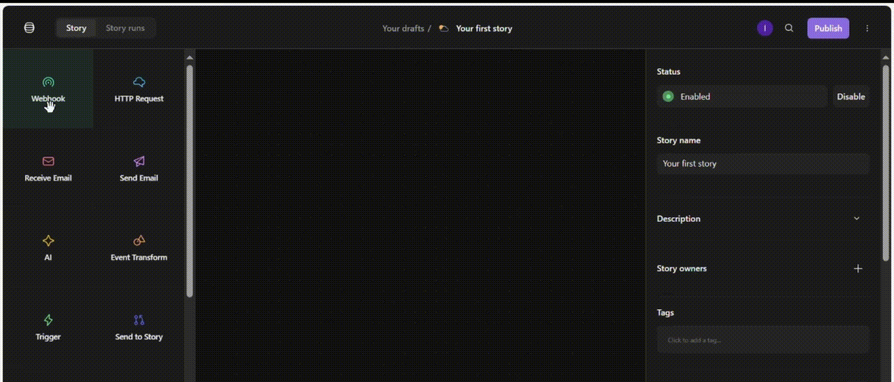
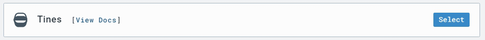

# SOAR-EDR
## Installation Documentation

### Prerequisites
- Kali Linux VM
- Internet connectivity
- Lima Charlie account
- Installation Key from Lima Charlie dashboard

### System Verification
Before installation, verify your system specifications:
```bash
# Check architecture
uname -m    
arch        

# Verify internet connectivity to Lima Charlie
curl -v https://limacharlie.io
telnet limacharlie.io 443
```

### LimaCharlie
#### Account Setup
To set up your Lima Charlie account, follow these steps:
1. Go to the Lima Charlie website and sign up for an account.
2. Fill out the registration form with your email address, password, and other required information.
#### Installation Key Creation and Session Download
To create an installation key and download the Lima Charlie session, follow these steps:

1. Navigate to the "Sensors" tab in the sidebar navigation.
2. From the dropdown menu, select "Installation Keys".
3. Click the "Create New Key" button to generate a new installation key.
4. Enter a descriptive name for your installation key and click "Create".
5. Scroll to the Session section, select Kali Linux 64-bit, and click "Download."

Alternatively, you can download the session directly from: https://downloads.limacharlie.io/sensor/linux/deb64


### Sensor Installation

1. Navigate to the directory where the downloaded .deb file is located.
```bash
cd /path/to/your/downloads
```
2. Install the LimaCharlie sensor
```bash
sudo dpkg -i limacharlie_4.31.1-1_amd64.deb
```

3. Copy the Sensor Key


4. Enter your installation key


5. Successful Installation Check
```bash
dpkg -l | grep limacharlie
```


6. Service Status
```bash
sudo systemctl status limacharlie
```


### Testing Tools Setup
#### LaZagne Password Recovery Tool

##### Overview
LaZagne is a tool for recovering locally stored passwords.

**IMPORTANT**: Only use this tool ethically and legally with proper authorization.

##### Installation Steps
1. Install Prerequisites: Update package list and install requirements
```bash
sudo apt update
```
```bash
sudo apt install git python3
```

2. Clone Repository: Get LaZagne from GitHub

```bash
git clone https://github.com/AlessandroZ/LaZagne.git
```

3. Setup and Execution: Navigate to LaZagne directory and run LaZagne
```bash
cd LaZagne
```
```bash
cd Linux
```
```bash
python3 laZagne.py
```
```bash
python3 laZagne.py all
```
### Creating a New Detection and Response (D&R) Rule
To create a new D&R rule in the Lima Charlie platform, follow these steps:

1. **Navigate to your organization:** Click on the name of the organization within the "All Organizations" section.


3. **Access the Automation menu:** Click on the "Automation" option in the left-hand navigation menu.
4. **Select D&R rule from the dropdown:** From the Automation menu, select "D&R rule" from the dropdown list.
5. **Create a new rule:** On the D&R rule page, click on the "New Rule" button to start creating a new rule.


**Configuring the Detect Descriptor**

In the Detect Descriptor, enter the following configuration:
```bash
event: NEW_PROCESS
op: and
rules:
  - op: is
    name: linux
  - op: or
    rules:
      - case sensitive: false
        op: ends with
        path: event/FILE_PATH
        value: python3.12
      - case sensitive: false
        op: ends with
        path: event/COMMAND_LINE
        value: all
      - case sensitive: false
        op: contains
        path: event/COMMAND_LINE
        value: lazagne
      - case sensitive: false
        op: is
        path: event/HASH
        value: "bbe76b860d1abdb0e1146cb2be037ba63cbf430d87af42e89de33bd46222764b"
```
In plain english: The even must be a (NEW_PROCESS AND must be a linux) AND file_path ends with python3.12 OR command_line ends with all OR command_line contains lazagne
OR hash == Lazagne hash.

**Configuration Explanation**

The Detect Descriptor configuration is designed to detect a specific type of malicious activity. The configuration is based on the analysis of a real-world event, as shown in the following JSON data:
```bash
{
  "event": {
    "COMMAND_LINE": "python3 laZagne.py all",
    "FILE_PATH": "/usr/bin/python3.12",
    "HASH": "bbe76b860d1abdb0e1146cb2be037ba63cbf430d87af42e89de33bd46222764b",
    ...
  },
  ...
}
```
The following conditions were chosen for the Detect Descriptor configuration:

1. NEW_PROCESS: We chose to focus on NEW_PROCESS events because when we run the Lazagne tool with the "all" argument, it creates a new process that can be detected in our organization's timeline. Specifically, we can see this event by navigating to our organization, then sensors, then sensors list, then choosing our machine, then scrolling to the timeline on the left navigation, and searching for "lazagne" in the search bar.

2. linux: We chose to focus on Linux-based systems because our project is based on a Kali Linux virtual machine.

3. python3.12: The FILE_PATH field contains "/usr/bin/python3.12", which indicates that the process was executed using Python 3.12.

4. all: The COMMAND_LINE field contains "python3 laZagne.py all", which suggests that the process was executed with the "all" argument.

5. lazagne: The COMMAND_LINE field contains "laZagne.py", which is a clear indication that the Lazagne tool was used.

6. hash: The HASH field contains "bbe76b860d1abdb0e1146cb2be037ba63cbf430d87af42e89de33bd46222764b", which is the hash of the Lazagne tool.

**Configuring the Respond Descriptor**

In the Respond Descriptor, enter the following configuration:
```bash
- action: report
  metadata:
    author: IN
    description: Detects LaZagne (SOAR-EDR Tool)
  falsepositives:
    - Unlikely
  level: medium
  tags:
    - attack.credential_access
  name: IN - HackTool - LaZAgne (SOAR-EDR)
```

### Creating a Slack Account and Setting Up a New Workspace

1. Go to the Slack website and sign up for an account.
2. After signing in, you'll be prompted to create a new workspace. Enter a name for your workspace and click "Continue".
3. On the next screen, you can invite teammates to join your workspace. Click "Skip for now".
4. Once in your workspace, click on the "+" icon next to "Channels" in the left-hand menu.
5. Enter the name "alerts" for your new channel and make sure the "Make public" option is selected.
6. Click "Create Channel" to create the new public channel.
7. After creating the channel, you will be prompted to add people to the channel. Click "Skip for now" to skip this step.


### Tines

1. Go to the Tines website and sign up for an account.

2. After signing in, you'll see an example story. Click the "X" icon to close the example, and then click "End Tour" to exit the tour.

3. Click on the "+ New" icon or the "Create a new story" button to start creating a new story.


4. Drag the "Webhook" action to the center of the story canvas.



5. Enter the following details for the webhook:
  - **Name**: "Retrieves Detections"
   
    
    
  - **Description**: "Retrieves LimaCharlie Detections"
   
    

6. Copy the Webhook URL.


7. Go to LimaCharlie and select your organization.


8. Click on "Outputs" in the left navigation menu.


9. Click on "Add Output".


10. Select "Detections" as the output stream.


11. In the "Choose Output Destination" section, select "Tines".



12. Configure the output destination for Tines:  Enter a name for the output, Paste the Webhook URL into the "Destination Host" field, Click "Save Output" to save the new output configuration.


