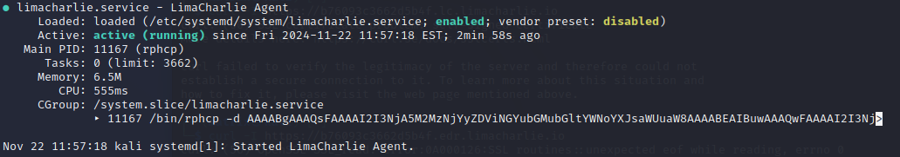

# SOAR-EDR
## Installation Documentation

### Prerequisites
- Kali Linux VM
- Internet connectivity
- Lima Charlie account
- Installation Key from Lima Charlie dashboard

### System Verification
Before installation, verify your system specifications:
```bash
# Check architecture
uname -m    
arch        

# Verify internet connectivity to Lima Charlie
curl -v https://limacharlie.io
telnet limacharlie.io 443
```

### LimaCharlie
#### Account Setup
To set up your Lima Charlie account, follow these steps:
1. Go to the Lima Charlie website and sign up for an account.
2. Fill out the registration form with your email address, password, and other required information.
#### Installation Key Creation and Session Download
To create an installation key and download the Lima Charlie session, follow these steps:

1. Navigate to the "Sensors" tab in the sidebar navigation.
2. From the dropdown menu, select "Installation Keys".
3. Click the "Create New Key" button to generate a new installation key.
4. Enter a descriptive name for your installation key and click "Create".
5. Scroll to the Session section, select Kali Linux 64-bit, and click "Download."

Alternatively, you can download the session directly from: https://downloads.limacharlie.io/sensor/linux/deb64


### Sensor Installation

1. Navigate to the directory where the downloaded .deb file is located.
```bash
cd /path/to/your/downloads
```
2. Install the LimaCharlie sensor
```bash
sudo dpkg -i limacharlie_4.31.1-1_amd64.deb
```

3. Copy the Sensor Key


4. Enter your installation key


5. Successful Installation Check
```bash
dpkg -l | grep limacharlie
```


6. Service Status
```bash
sudo systemctl status limacharlie
```



### Testing Tools Setup
#### LaZagne Password Recovery Tool

##### Overview
LaZagne is a tool for recovering locally stored passwords.

**IMPORTANT**: Only use this tool ethically and legally with proper authorization.

##### Installation Steps
1. Install Prerequisites: Update package list and install requirements
```bash
sudo apt update
```
```bash
sudo apt install git python3
```

2. Clone Repository: Get LaZagne from GitHub

```bash
git clone https://github.com/AlessandroZ/LaZagne.git
```

3. Setup and Execution: Navigate to LaZagne directory and run LaZagne
```bash
cd LaZagne
```
```bash
cd Linux
```
```bash
python3 laZagne.py
```
```bash
python3 laZagne.py all
```
### Creating a New Detection and Response (D&R) Rule
To create a new D&R rule in the Lima Charlie platform, follow these steps:

1. **Navigate to your organization:** Click on the name of the organization within the "All Organizations" section.


3. **Access the Automation menu:** Click on the "Automation" option in the left-hand navigation menu.
4. **Select D&R rule from the dropdown:** From the Automation menu, select "D&R rule" from the dropdown list.
5. **Create a new rule:** On the D&R rule page, click on the "New Rule" button to start creating a new rule.


**Configuring the Detect Descriptor**

In the Detect Descriptor, enter the following configuration:
```bash
event: NEW_PROCESS
op: and
rules:
  - op: is
    name: linux
  - op: or
    rules:
      - case sensitive: false
        op: ends with
        path: event/FILE_PATH
        value: python3.12
      - case sensitive: false
        op: ends with
        path: event/COMMAND_LINE
        value: all
      - case sensitive: false
        op: contains
        path: event/COMMAND_LINE
        value: lazagne
      - case sensitive: false
        op: is
        path: event/HASH
        value: "bbe76b860d1abdb0e1146cb2be037ba63cbf430d87af42e89de33bd46222764b"
```
In plain english: The even must be a (NEW_PROCESS AND must be a linux) AND file_path ends with python3.12 OR command_line ends with all OR command_line contains lazagne
OR hash == Lazagne hash.

**Configuration Explanation**

The Detect Descriptor configuration is designed to detect a specific type of malicious activity. The configuration is based on the analysis of a real-world event, as shown in the following JSON data:
```bash
{
  "event": {
    "COMMAND_LINE": "python3 laZagne.py all",
    "FILE_PATH": "/usr/bin/python3.12",
    "HASH": "bbe76b860d1abdb0e1146cb2be037ba63cbf430d87af42e89de33bd46222764b",
    ...
  },
  ...
}
```
The following conditions were chosen for the Detect Descriptor configuration:

1. NEW_PROCESS: We chose to focus on NEW_PROCESS events because when we run the Lazagne tool with the "all" argument, it creates a new process that can be detected in our organization's timeline. Specifically, we can see this event by navigating to our organization, then sensors, then sensors list, then choosing our machine, then scrolling to the timeline on the left navigation, and searching for "lazagne" in the search bar.

2. linux: We chose to focus on Linux-based systems because our project is based on a Kali Linux virtual machine.

3. python3.12: The FILE_PATH field contains "/usr/bin/python3.12", which indicates that the process was executed using Python 3.12.

4. all: The COMMAND_LINE field contains "python3 laZagne.py all", which suggests that the process was executed with the "all" argument.

5. lazagne: The COMMAND_LINE field contains "laZagne.py", which is a clear indication that the Lazagne tool was used.

6. hash: The HASH field contains "bbe76b860d1abdb0e1146cb2be037ba63cbf430d87af42e89de33bd46222764b", which is the hash of the Lazagne tool.

**Configuring the Respond Descriptor**

In the Respond Descriptor, enter the following configuration:
```bash
- action: report
  metadata:
    author: IN
    description: Detects LaZagne (SOAR-EDR Tool)
  falsepositives:
    - Unlikely
  level: medium
  tags:
    - attack.credential_access
  name: IN - HackTool - LaZAgne (SOAR-EDR)
```

### Creating a Slack Account and Setting Up a New Workspace

1. Go to the Slack website and sign up for an account.
2. After signing in, you'll be prompted to create a new workspace. Enter a name for your workspace and click "Continue".
3. On the next screen, you can invite teammates to join your workspace. Click "Skip for now".
4. Once in your workspace, click on the "+" icon next to "Channels" in the left-hand menu.
5. Enter the name "alerts" for your new channel and make sure the "Make public" option is selected.
6. Click "Create Channel" to create the new public channel.
7. After creating the channel, you will be prompted to add people to the channel. Click "Skip for now" to skip this step.


### Tines

1. Go to the Tines website and sign up for an account.

2. After signing in, you'll see an example story. Click the "X" icon to close the example, and then click "End Tour" to exit the tour.

3. Click on the "+ New" icon or the "Create a new story" button to start creating a new story.


4. Drag the "Webhook" action to the center of the story canvas.


5. Enter the following details for the webhook:
  - **Name**: "Retrieves Detections"
   
    
    
  - **Description**: "Retrieves LimaCharlie Detections"
   
    

6. Copy the Webhook URL.


7. Go to LimaCharlie and select your organization.


8. Click on "Outputs" in the left navigation menu.


9. Click on "Add Output".


10. Select "Detections" as the output stream.


11. In the "Choose Output Destination" section, select "Tines".


12. Configure the output destination for Tines:  Enter a name for the output, Paste the Webhook URL into the "Destination Host" field, Click "Save Output" to save the new output configuration.


### Connecting Tines to Slack
Scroll down on the left side navigation bar, click on the Templates, then drag the slack to the center of the canvas story, click on the slack and on the build tab search for send a message,
head over to slack and right click to the alerts channel, click the view channel from this window, scroll down on the about tab and copy the channel id, head back to slack and paste the channel id to the Channel / User ID on the Build tab, then click connect to slack, then it will open a window asking if you want to use slack on your own Slack app or use Tine's app for SLack and we will click use Tine's app for SLack, then we click allow on the other page that we got redirected after choosing "use Tine's app for Slack"., then you can run it to see if it sends the messages to slack (in your browser interface of Slack).

1. Scroll down on the left side navigation bar and click on Templates.


 
3. Drag the Slack template to the center of the canvas story.


   
5. Click on the Slack template and navigate to the Build tab.


6. Search for "send a message" in the Build tab and click on it.


   
8. In Slack, right-click on the Alerts channel and select "View channel" from the dropdown menu.
9. In the About tab, scroll down and copy the Channel ID.
10. Go back to Tines and paste the Channel ID into the Channel / User ID field on the Build tab.
11. On the Build tab of this slack, Click "Connect to Slack".
12. A window will appear asking if you want to use your own Slack app or Tine's app for Slack. Select "Use Tine's app for Slack".
13. You will be redirected to another page where you need to click "Allow".
14. Once connected, you can run the template to test if it sends messages to Slack (in your browser interface of Slack).


### Connecting Tines with Email
on the left side navigation bar, drag the send email to the center of the storys canvas, click on the send email, and on the right side, on the Build tab, set a descrittion
as Send email, in the Recipients there are Specify the email address or list of email addresses to send to. and Reply to you can add any email is Specify the email address that should be used as the Reply-To address of the email., on the SEnder name set it as Alerts and Subject as Test for now.

###note Click in the background of the canvas story to return to the main view. This will allow you to see the left side panel, which includes details such as Status, Story name, Description, Story owner, Tags, and Credentials, and then under Credentials section
### Isolate Computer Prompt
to create a user prompt, we will use a page, place your mouse to Tools, then it will appear on the side 3 options, we will drag page to the centecr of the story canvas. at the right side in the Build tab, we set the name as User prompt, in the description set it as Isolate Computer (Yes/No), the Access Control choose Members of this Tines tenant, Page behavour choose Show success message, Success message set it as Thank you, you can now close this window..., and then link tines with User prompt, then click edit page, Then we enter in the heading content IN-SOAR-EDR-Project, then click below this to edit the text and enter Do you want to isolate the machine? (actually here will be our interesting field with our info), then on the left side navigation search for Input fileds section and then drag the boolean button to the the box, then we change the name boolean to Isolate? (and here the isolate should be "Do you want to isolate the machine?, thats it for now.

### include the details into our messages
so click to the webhook and then click to events, if you dont have an event yet, head back to your virtual machine and execute again LaZagne in your terminal (assuming you have connected Tines with limaCHarlie), then we go back to the webhook, then event, we select an event, then in the center there will be the info, then we expand the "retrieve_detection", then expand "body", then expand "event" and "routing". copy "cat", "link", in "event" copy "COMMAND_LINE" and "FILE_PATH", and then in "routing" copy 
"hostname", "event_time", "int_ip", "sid". we could do this differently, we could click to Slack in our Story in Tines, then on the right side on the Build tab, on the Message field we click the plus button, then value, here we are interested in Data section, (the reson we see the Data section is because there is a link between webhook and Slack), so lets clikc on retrieve_detections on the Data section, click again and it will add a dot and then in Data section it will show "body", "headers", "response". we want to select body, so we clikc on body, then click again, then you can see all the data of the body, then we can click on the cat (but dont click cat again, it will add a dot and cause an error), this will show our title. to save just click out of this window. but we will paste in all of our information that we copied into our notepad. we will make it little more user friendly by adding some infor, Tittle:, Time:, Computer:, Source IP:, Username:, FIle Path:, Command Line:, Sensor ID:, Detection Link:. do the same thing for the email, but the only difference is we will but each of then inside a <br> to create line break bcs it is an html for email. we do the same we paste that into our contents section under title in our User Prompt page.


### Handling User Response (No)
on the left side, drag the trigger in the middle of the canvas story below user prompt. on the right side on the Build tab set the Name as no, then at Rules click the plus, then click on value then in this window we click user_prompt at the Data section, click again, then click body, click again to body and then click isolate once (make sure it has not dot after isolate). then below leave it as "is equal to" and then the field below this set it as false. now we copy the slack we have in our story canvas and paste it below our No trigger, and then click on it and in the right side on the build tab we will edit the message, where we delete the current data there, and enter "The computer: {}retrieve_detections.body.routing.hostname was not isolated, please investigate." then connect No trigger to this slack. to test it, click on the user prompt, then click on the arrow (wehere it says visit page if you hover the mouse there) besides the event, then below you might see recent events (now if you dont have any events or you have submitted them before, you can generate a new event by clicking into the webhook above, then events, then select on a previus event and then click re-emit, this just run the again the same detection),then select one event or the recent one, then you will be redirected to the user prompt page, then we select No and submit, then go back to slack, to alerts channel and see if you got the message "The computer: {}retrieve_detections.body.routing.hostname was not isolated, please investigate.

### Handling User Response (Yes)
we will add another trigger, so copy the No trigger and paste it to the side. change the Name field to Yes on the right side in the Build tab and in the Rules change the false to true. then on the left side of the page click on the Templates, then search LimaCharlie in the search box, then drag to the center of the canvas story below the Yes trigger (LimaCharlie know which machine to isolate because of the Sensor ID). now click on this LimaCharlie, in the right side on the Build tab in the search box search isolate sensor, then select isolate sensor. then after we select this, we will have name and description to Isolate Sensor, then we will change the URL https://api.limacharlie.io/v1/{}sid/isolation to https://api.limacharlie.io/v1/{}retrieve_detections.body.detect.routing.sid/isolation, then connect Yes trigger to Isolate sensor. now we need to connect this (HTTP Request: Isolate Sensor) using a credential. now go back to your dashboard in Tines clicking the top left corner Tines icon, then you will see your stories, then click Your drafts on the side of the Tines icon that is in the top left corner, then click + new button, and then on the dropdown options select text. go back to limacharlie organzation, then scroll down and then click access managment, then click Rest API, then copy Org JWT, go back to Tines where we selected text, type limacharlie for name field, type LimaCharlie API for description field, then paste the Org JWT that we copied from LimaCharlie in the Value field, then in Domains field type *.limacharlie.io (this ensures that the credentials can only be used towards this site), then click save. now back to our story (click on nothing) and on the right side where is the Status, on the credentials sections click connect and then select our credentials that we created

### isolation status and message
now on the left side click Templates, search LimaCharlie, drag Limacharlie template to the center of canvas story below Isolate sensor, click on it and in the right side on the Build tab we search get isolation status on the search box, then select get isolation status, change the URL to https://api.limacharlie.io/v1/{}retrieve_detections.body.detect.routing.sid/isolation, then in the headers section here we need to change the Bearer, and to change this we click on nothing in the middle of the story canvas, then on the right side it will show the Credentials and then click connect on LimaCharlie and then select limacharlie that we created, then we copy a slack and paste below this Get Isolation Status, and then we update the message to 
Isolation Status: {}get_isolation_status.body.is_isolated
The computer: {}retrieve_detections.body.detect.routing.hostname has been isolated.
